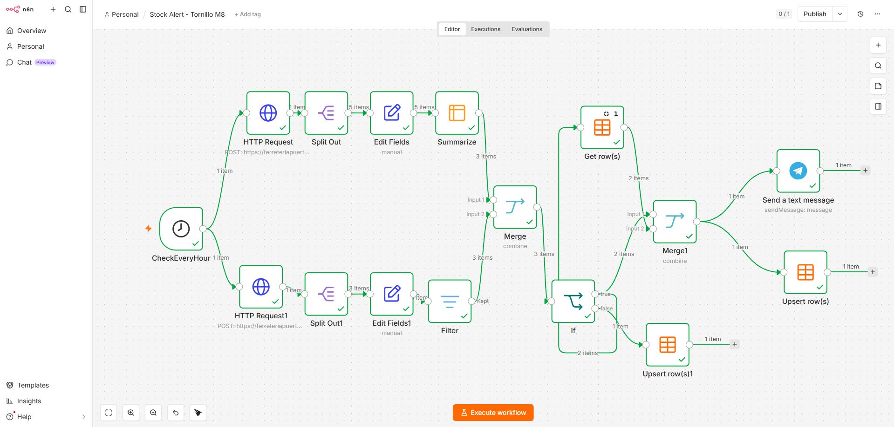
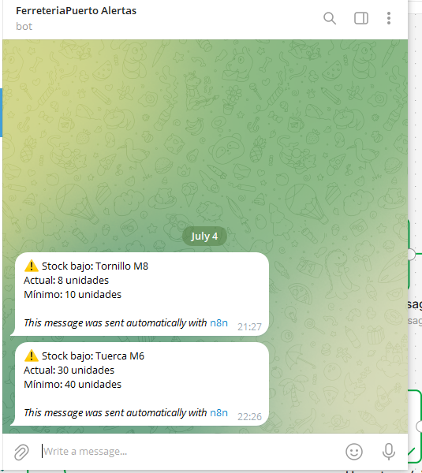

# Stock Alert — Odoo + n8n

Workflow de automatización que monitoriza el stock de dos productos en Odoo (Tornillo M8, Tuerca M6) y notifica por Telegram únicamente cuando el estado cambia de "OK" a "bajo mínimo" — evitando alertas repetidas mientras el stock permanece bajo (alert fatigue).

Proyecto de práctica desarrollado sobre una instancia real de Odoo, en el marco de mi formación como consultor funcional.

## Problema que resuelve

El stock de piezas críticas puede caer por debajo del mínimo sin que nadie se entere hasta la siguiente revisión manual. En un entorno real, eso significa producción parada o ventas perdidas.

## Cómo funciona

1. Un trigger horario (`Cron`) consulta la API REST de Odoo para cada producto monitorizado.
2. Los datos se transforman y se comparan contra el stock mínimo configurado.
3. Una tabla de estado (`Data Table` de n8n) recuerda si el producto ya fue alertado.
4. Solo se envía notificación por Telegram si el producto pasó de "OK" a "bajo mínimo" respecto al ciclo anterior.
5. Cuando el stock se recupera por encima del mínimo, el estado se resetea automáticamente.

## Stack

- n8n (workflow engine)
- API REST de Odoo
- Data Table (persistencia de estado, nativo de n8n)
- Telegram Bot API

## Capturas

**Workflow completo:**

**Alerta en Telegram:**

## Bitácora técnica

El desarrollo de este proyecto tuvo varios bloqueos técnicos reales — desde comportamiento no documentado de nodos hasta decisiones de diseño sobre el modelo de datos de Odoo. Todo el proceso, incluyendo diagnósticos erróneos y su corrección, está documentado en detalle en [`bloqueos-tecnicos.md`](bloqueos-tecnicos.md).

## Deuda técnica conocida

Ver el detalle completo en la bitácora técnica. Resumen:
- Un campo personalizado de Odoo (`reordering_min_qty`) no está marcado como `store=True`; se mitigó filtrando en n8n en vez de modificar el modelo sin autorización del cliente.
- La alineación entre IDs de `product.template` y `product.product` funciona solo porque el catálogo actual no tiene variantes de producto.
- No hay gestión de error si la API de Odoo devuelve un código 5xx.

## Archivo del workflow

El export completo del workflow (`.json`, importable directamente en n8n) está en [`stock-alert-tornillo-m8-m6.json`](stock-alert-tornillo-m8-m6.json).

